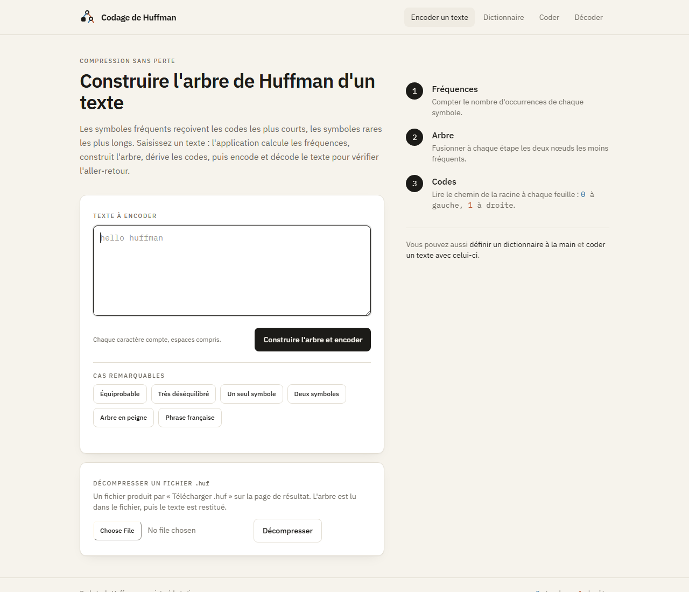
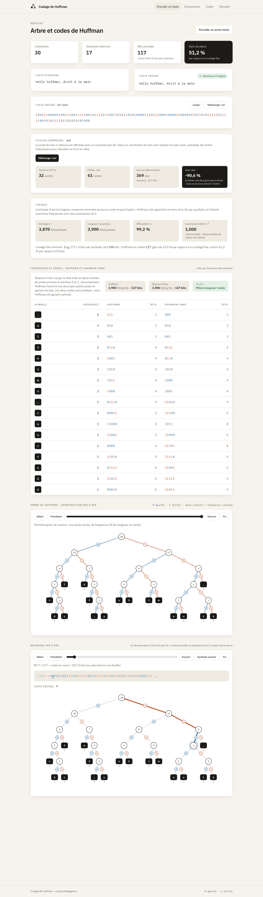
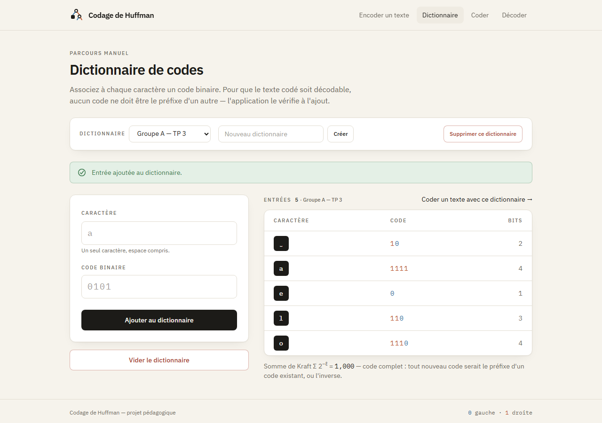
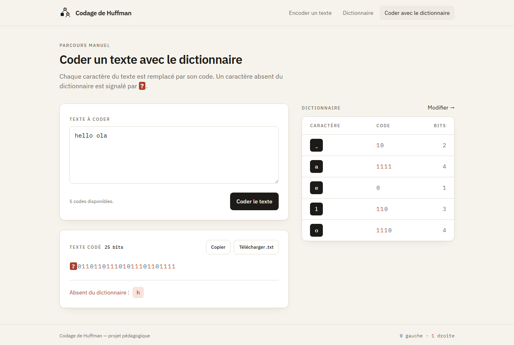
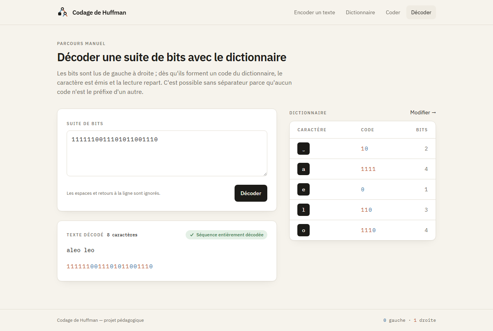

# Codage de Huffman

Application web pédagogique (Jakarta Servlet 6 / JSP, Tomcat 10.1, PostgreSQL) qui illustre
la compression de Huffman de deux façons :

- **Parcours automatique** — saisir un texte : fréquences, arbre, codes, texte encodé, décodage
  de contrôle, taux de compression, et **construction de l'arbre rejouable pas à pas** (file de
  priorité, fusions successives, paire suivante mise en évidence). Aucune base de données nécessaire.
- **Cas remarquables** — sur l'accueil, six exemples en un clic (équiprobable, très déséquilibré, un seul
  symbole, deux symboles, arbre en peigne, phrase française) avec l'explication de ce qu'ils illustrent.
- **Décodage pas à pas** — la suite de bits est relue sur l'arbre final : curseur bit par bit ou symbole
  par symbole, chemin en cours surligné dans l'arbre, texte décodé qui s'allonge, `#bit=N` dans l'URL.
- **Théorie** — entropie de Shannon, longueur moyenne du code, efficacité H/L, somme de Kraft et
  comparaison avec le codage fixe minimal ⌈log₂ k⌉ ; la page du dictionnaire affiche la somme de Kraft
  des codes saisis et la place restante.
- **Shannon-Fano côte à côte** — les codes de Shannon-Fano calculés sur les mêmes fréquences, dans la
  table des symboles, avec la longueur moyenne et le nombre de bits de chaque méthode et un verdict.
- **Fichier compressé réel** — téléchargement d'un `.huf` binaire (en-tête, arbre en pré-ordre, bits
  tassés par octet) avec sa taille exacte face au texte UTF-8, et décompression d'un `.huf` depuis l'accueil.
- **Parcours manuel** — construire soi-même un dictionnaire (caractère → code binaire), persisté
  en base, puis coder un texte avec, et **décoder une suite de bits** (erreur localisée au bit près :
  caractère étranger, bits sans code, séquence incomplète). L'application refuse les codes ambigus
  (doublons, préfixes). **Plusieurs dictionnaires nommés** peuvent coexister (un par groupe ou par
  exercice) : sélecteur sur les pages du parcours manuel, création et suppression, choix mémorisé
  par un cookie.

Usage prévu : un poste, un utilisateur, pas d'authentification.

## Aperçu

**Accueil** — saisie du texte, cas remarquables en un clic, rappel des trois étapes, décompression d'un fichier `.huf`.



**Résultat** — indicateurs de compression, contrôle de l'aller-retour, texte encodé (0 en bleu, 1 en terre cuite),
taille réelle du fichier `.huf`, entropie et somme de Kraft, codes de Huffman et de Shannon-Fano côte à côte,
construction de l'arbre rejouable pas à pas, décodage pas à pas.



**Dictionnaire** — choix du dictionnaire nommé, saisie d'un couple caractère / code avec validation (doublons, préfixes),
messages explicites et somme de Kraft.



**Codage par dictionnaire** — les caractères sans code sont signalés par `?` et listés sous le résultat.



**Décodage par dictionnaire** — la suite de bits est relue avec le dictionnaire ; une erreur est localisée au bit près.



## Prérequis

- JDK 17 ou plus récent (`javac`, `jar` dans le `PATH`) ; testé avec le JDK 21.
- Apache Tomcat 10.1 (Jakarta EE 10). Pas de `web.xml` : servlets et filtres sont déclarés par annotations.
- PostgreSQL (parcours manuel uniquement).

## Base de données

Création (détruit une base `huffman` existante) :

```
psql -U postgres -f database/database.sql
```

Mise à niveau d'une base déjà en place, sans perte de données (dans l'ordre, chacun une seule fois) :

```
psql -U postgres -d huffman -f database/upgrade-001-contraintes.sql
psql -U postgres -d huffman -f database/upgrade-002-dictionnaires.sql
```

Le second crée la table `dictionnaire`, rattache les entrées existantes à un dictionnaire « Principal »
et rend l'unicité des caractères et des codes relative à chaque dictionnaire.

## Configuration

La connexion se configure par variables d'environnement ou propriétés système Java (`-D`, prioritaires) :

| Variable               | Défaut                                      |
|------------------------|---------------------------------------------|
| `HUFFMAN_DB_URL`       | `jdbc:postgresql://localhost:5432/huffman`  |
| `HUFFMAN_DB_USER`      | `postgres`                                  |
| `HUFFMAN_DB_PASSWORD`  | aucun — obligatoire (`PGPASSWORD` accepté)  |

Sous Tomcat lancé par `startup.bat`, créer `%CATALINA_HOME%\bin\setenv.bat` :

```bat
set "HUFFMAN_DB_PASSWORD=votre_mot_de_passe"
```

Pour Tomcat installé en service Windows, définir la variable dans l'environnement système
(ou `-DHUFFMAN_DB_PASSWORD=...` dans les options Java du service), puis redémarrer le service.

Sans mot de passe configuré, les pages du parcours manuel affichent « Base de données injoignable » ;
le parcours automatique fonctionne quand même.

## Déploiement

```
deploy.bat
```

Compile `src/`, assemble `temp/` puis `huffman.war`, et le copie dans `%CATALINA_HOME%\webapps`
(défaut : `C:\Program Files\Apache Software Foundation\Tomcat 10.1`). Application servie sur
`http://localhost:8080/huffman/`. Un ancien `huffmen.war` (faute de frappe historique) peut être supprimé de `webapps`.

## Tests

```
test.bat
```

Compile `src/` et `test/` puis exécute les tests JUnit 5 (lanceur autonome dans `lib/test/`) :
aller-retour encodage/décodage, symbole unique, texte vide, absence de préfixe, règles du dictionnaire,
encodage par point de code.

## Organisation du code

```
src/hery/itu/
  huffman/   cœur algorithmique, sans dépendance web ni base
             HuffmanTree (fréquences, arbre, codes, trace des fusions), HuffmanEncoder, HuffmanDecoder,
             HuffmanFile (format binaire .huf), CodeStatistics (entropie, Kraft), ShannonFano,
             DictionaryValidator (règles d'admission),
             DictionaryEncoder / DictionaryDecoder (codage et décodage par dictionnaire)
  base/      Database (connexion configurée par l'environnement),
             DictionaryRepository (tables dictionnaire et dico)
  servlet/   points d'entrée HTTP : /huffman, /compress, /decompress, /insertDictionary,
             /clearDictionary, /dictionaries, /encodeText, /decodeText
  web/       filtres : page d'erreur applicative, contrôle d'origine des POST (CSRF)
  util/      Html : échappement et rendu des bits pour les vues
web/
  index.jsp            accueil (seule JSP servie directement)
  WEB-INF/views/       vues servies par les servlets
  WEB-INF/jspf/        fragments communs (entête + design system, navigation, pied, table et sélecteur de dictionnaire)
  assets/              Tailwind 3.4.17 et D3 7.9.0 auto-hébergés
lib/                   jars d'exécution ; lib/provided/ (fourni par Tomcat) ; lib/test/ (JUnit)
database/              schéma et mise à niveau
```

Dans un IDE, ajouter `lib/*.jar`, `lib/provided/*.jar` et `lib/test/*.jar` au classpath du projet.

## Choix et limites connus

- Le CSS est produit dans le navigateur par le compilateur Tailwind (script auto-hébergé, version figée).
  C'est un compromis pour rester sans outil de build Node ; pour un usage intensif, générer une feuille
  CSS statique avec l'outil Tailwind.
- Les polices IBM Plex sont chargées depuis Google Fonts ; hors connexion, les polices système de repli sont utilisées.
- Le filtre d'origine compare l'en-tête `Origin` du navigateur à l'hôte et au port vus par Tomcat.
  Derrière un mandataire qui réécrit l'hôte ou le schéma, adapter `SameOriginFilter.expectedOrigin`.
- Jasper (Tomcat 10.1) compile les JSP au niveau Java 11 : pas de `switch` fléché ni de `var` dans les scriptlets.
- Le parcours automatique travaille par unité UTF-16 (`char`) ; un emoji y compte pour deux symboles
  qui se recombinent au décodage. Le parcours manuel travaille par point de code.
